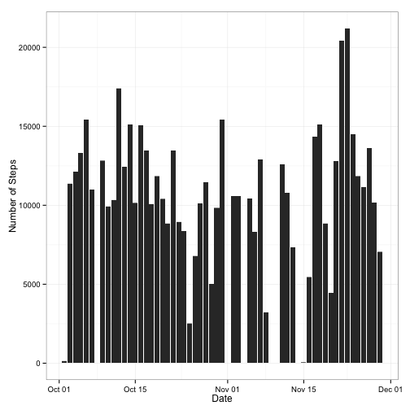
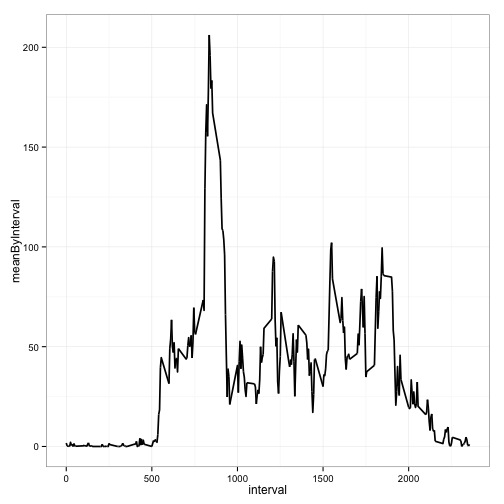
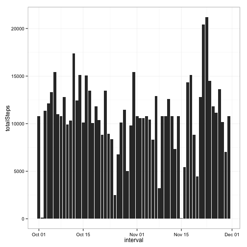
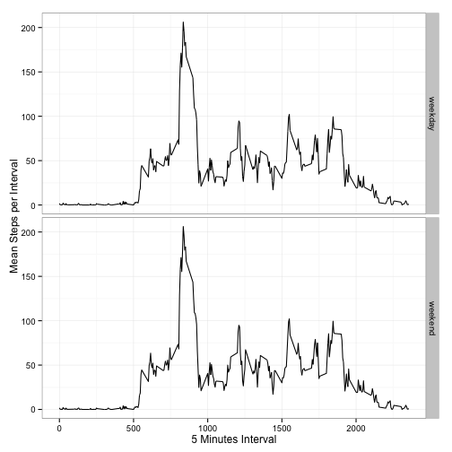

# Reproducible Research: Peer Assessment 1

## Activity Per Day: Coursera Homework
This script was created to fulfill Courser's Reproducible Research programming homework 1. It follows a series of steps highlighted by headers.

# Dependencies

Before we start, let's load the dependencies this script has:


```r
library(ggplot2)
```

# Loading and preprocessing the data

First we have to load data provided by the assignment. The data can be found in the `data` folder. We will be loading it with the `read.csv()` function: 


```r
data <- read.csv('data/activity.csv')
```

Then we'll do a series of clean-up steps:


```r
data$date <- as.Date(data$date)
data$interval <- as.numeric(data$interval)
```

# What is mean total number of steps taken per day?

To start exploring the data, we build a simple histogram with the total number of number of steps taken each day:


```r
ggplot(data) + theme_bw() +
  geom_histogram(aes(date, steps), stat = 'identity') +
  ylab('Number of Steps') +
  xlab('Date')
```

```
## Warning: Removed 2304 rows containing missing values (position_stack).
```

 

We also explore the mean and median measurements quickly: 


```r
summary(data$interval)
```

```
##    Min. 1st Qu.  Median    Mean 3rd Qu.    Max. 
##     0.0   588.8  1178.0  1178.0  1766.0  2355.0
```

# What is the average daily activity pattern?

It is important to calculate the average per day, and not simply to the whole dataset as follows:


```r
data$meanByInterval <- tapply(data$steps, data$interval, mean, na.rm = TRUE)
```

Then we make a plot with that mean: 


```r
ggplot(data) + theme_bw() + 
  geom_line(aes(interval, meanByInterval), stat = 'identity', size = .8)
```

 

# Which 5-minute interval, on average across all the days in the dataset, contains the maximum number of steps?

Interestingly, the largest mean is that of the interval **835** as follows:


```r
data[which.max(data$meanByInterval),]
```

```
##     steps       date interval meanByInterval
## 104    NA 2012-10-01      835       206.1698
```

# Imputing missing values

NAs seem to be a problem. As seen below, there are **2304** NAs:


```r
summary(is.na(data$steps))
```

```
##    Mode   FALSE    TRUE    NA's 
## logical   15264    2304       0
```

It could be a good idea to fill those 2304 NA records. Let's explore a couple of methods: to explore if the means by intervals or by days would be better.


```r
meanByDay <- data.frame(mean = tapply(data$steps, data$date, mean, na.rm = TRUE))
meanByInterval <- data.frame(mean = tapply(data$steps, data$interval, mean, na.rm = TRUE))
```

As seen below the mean by day seems to have less variance than by interval. However NAs seem to be generated by day not intervals. Due to that i'll use the mean by day.


```r
var(meanByDay, na.rm = TRUE)  # 215.6056
```

```
##          mean
## mean 219.7374
```

```r
var(meanByInterval, na.rm = TRUE)  # 1489.825
```

```
##          mean
## mean 1494.931
```

To keep things organized we will create a new dataset called `newData`: 


```r
newData <- data
```
Let's then populate that new dataset with mean data by interevals. In order to do that, we create a simple function that iterates over every record and populats it with the appropriate values:


```r
populateNAs <- function (df = NULL) {
  cat("populating NAs")
  # calculating the mean by interval
  meanByInterval <- data.frame(mean = tapply(data$steps, data$interval, mean, na.rm = TRUE))
  
  # iterating and populating NAs
  for (i in 1:nrow(newData)) {
    df$steps[i] <- ifelse(is.na(data$steps[i]),meanByInterval[rownames(meanByInterval) == data$interval[i],],data$steps[i])
  }
  cat("\ndone")
  return(df)
}

newData <- populateNAs(newData)
```

```
## populating NAs
## done
```

Let's take a look at how filling those NAs has impacted our data by summarizign the data:


```r
summary(newData$steps)
```

```
##    Min. 1st Qu.  Median    Mean 
##    0.00    0.00    0.00   37.38 
## 3rd Qu.    Max. 
##   27.00  806.00
```

```r
summary(data$steps)
```

```
##    Min. 1st Qu.  Median    Mean 
##    0.00    0.00    0.00   37.38 
## 3rd Qu.    Max.    NA's 
##   12.00  806.00    2304
```

```r
var(data$steps)  
```

```
## [1] NA
```

```r
var(data$steps, na.rm = T)  
```

```
## [1] 12543
```

Then we make make a histogram of the total number of steps taken each day, calculating and report the mean and median total number of steps taken per day.


```r
totalSteps <- data.frame(totalSteps = tapply(newData$steps, newData$date, sum))
totalSteps$interval <- as.Date(rownames(totalSteps))

# making histogram
ggplot(totalSteps) + theme_bw() +
  geom_histogram(aes(interval, totalSteps), stat = 'identity')
```

 

The variance changes a bit: it decreases from **12543** to **11093.31**. We could infer that analysis becomes a bit more balanced.


# Are there differences in activity patterns between weekdays and weekends?

It is important to understand the difference between the weekdays and weekends. In order to do that we create a simple sorter:


```r
  newData$weekOrWeekend <- ifelse(
    weekdays(as.Date(newData$date)) == "Monday" |
    weekdays(as.Date(newData$date)) == "Tuesday" |
    weekdays(as.Date(newData$date)) == "Wednesday" |
    weekdays(as.Date(newData$date)) == "Thursday" |
    weekdays(as.Date(newData$date)) == "Friday",
             newData$weekOrWeekend <- 'weekday',
             newData$weekOrWeekend <- 'weekend'
    )
```

We also transform it to a factor variable:

```r
newData$weekOrWeekend <- as.factor(newData$weekOrWeekend)
```

Let's take a look at it to make sure it worked well:

```r
summary(newData$weekOrWeekend)
```

```
## weekday weekend 
##   12960    4608
```

Calculating the average number of steps taken, averaged across all weekday days or weekend days.

```r
newData$intervalMean <- tapply(newData$steps, newData$interval, mean)
```

Finally we create a plot that uses analyzes data based on their week or weekend variable:


```r
ggplot(newData) + theme_bw() +
  geom_line(aes(interval, intervalMean), stat = 'identity') + 
  facet_grid(weekOrWeekend ~ .) + 
  ylab('Mean Steps per Interval') + 
  xlab('5 Minutes Interval')
```

 
